# Forma rudimentaria de volcar el kernel y el rootfs en una máquina virtual de fortigatemanager FMG 7.2.4

0. Montar el disco de la VM; así podríamos tener el archivo vmlinuz y el archivo rootfs.gz

   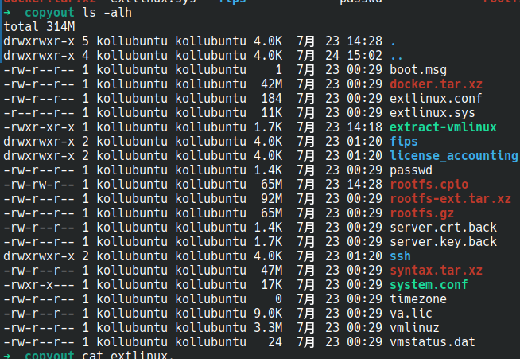

   Normalmente adoptamos el [script extract-vmlinux](https://github.com/torvalds/linux/blob/master/scripts/extract-vmlinux) para obtener la imagen vmlinux a partir de un archivo de kernel comprimido, pero en esta versión, no funciona según lo esperado.

   El script busca un número mágico predefinido del encabezado de salida de compresión soportado por mainline, el cual en este caso no existe en el archivo vmlinuxz.

   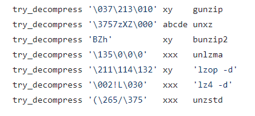

   La mejor suposición es que el kernel está cifrado; podría haber dos posibilidades:

   ​	a. El cargador de arranque `extlinux` es responsable de descifrar el kernel vmlinux.

   ​	b. El código de etapa temprana de vmlinuz es responsable del descifrado.

   Considerando que la primera etapa del cargador de arranque extlinux es demasiado pequeña en tamaño, saltamos al archivo extlinux.sys; tras inspeccionar el archivo extlinux.sys, la primera posibilidad queda descartada.

1. Arrancar la VM con qemu en modo depuración (debug)

   Para arrancar el FMG, necesitamos un disco adicional como disco de datos:

   ```bash
   qemu-img create -f qcow2 virtiob.qcow2 20G
   ```

   Ahora hay dos discos: `virtioa.qcow2` y `virtiob.qcow2`.

   Añada los flags `-S` y `-s` a qemu para habilitar la escucha de depuración remota de gdb:

   ```bash
   qemu-system-x86_64  -drive file=virtioa.qcow2 -drive file=virtiob.qcow2 -m 4G -smp 4 -s -S -netdev tap,id=net0,ifname=tap0,script=no,downscript=no -device virtio-net-pci,netdev=net0 -netdev tap,id=net1,ifname=tap1,script=no,downscript=no -device virtio-net-pci,netdev=net1 -netdev tap,id=net2,ifname=tap2,script=no,downscript=no -device virtio-net-pci,netdev=net2 -netdev tap,id=net3,ifname=tap3,script=no,downscript=no -device virtio-net-pci,netdev=net3
   ```

2. Abrir ida64 y conectarse al stub de gdb de qemu

   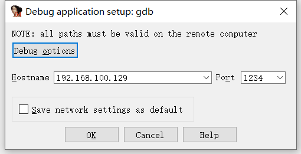

Una vez establecida la conexión, añada una región de memoria manual que comience en `0x0` y termine en `0xFFFFFFFFFFFFFFF0`.

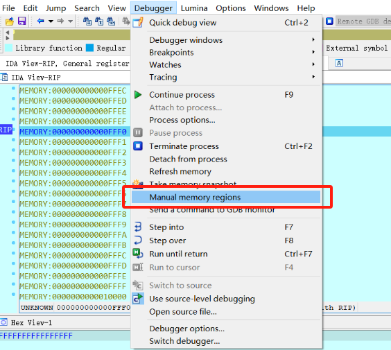

Así:

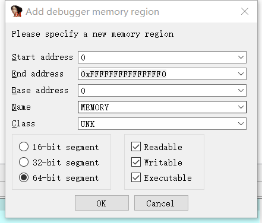

3. Basándonos en el [proceso de arranque del kernel de linux](https://0xax.gitbooks.io/linux-insides/content/Booting/linux-bootstrap-5.html) y el [código relacionado](https://elixir.bootlin.com/linux/v4.14.200/source/arch/x86/boot/compressed/misc.c#L279), sabemos que el kernel tiene varias etapas de arranque; nuestra mejor suposición es que el descifrado de vmlinux ocurre justo antes de la descompresión de vmlinux.

   Del protocolo de arranque podríamos obtener algunas direcciones para establecer puntos de interrupción (breakpoints).

   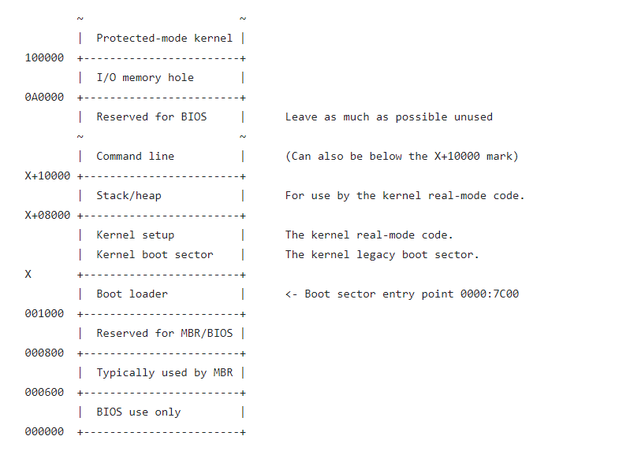

   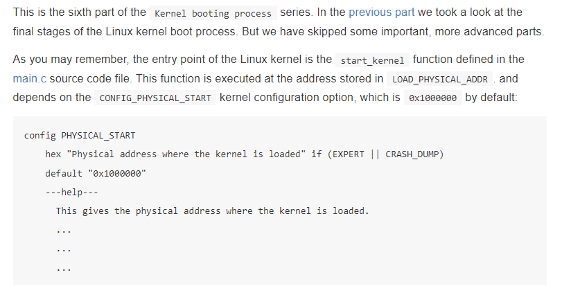

   Establezca un breakpoint en 0x100000 y observe primero dónde comienza la etapa temprana.

4. Después de un tiempo, podríamos encontrar la función en `sub_13C5D00`, que es la función `extract_kernel` en `arch/x86/boot/compressed/misc.c` del código fuente.

   El prototipo de esta función extract_kernel es el siguiente; al hacer un break en la entrada podemos obtener los dos argumentos `output` y `output_len`, que son el `puntero al kernel descomprimido` y el `entero de longitud de datos del kernel descomprimido` respectivamente.

   ```c
   asmlinkage __visible void *extract_kernel(void *rmode, memptr heap,
   				  unsigned char *input_data,
   				  unsigned long input_len,
   				  unsigned char *output,
   				  unsigned long output_len)
   ```

   Cambie el prototipo de la función en ida de la siguiente manera:

   ```c
   void *__usercall sub_13C5D00@<rax>(void *rmode@<rdi>, void *heap@<rsi>, unsigned __int8 *input_data@<rdx>, unsigned int input_len@<ecx>, unsigned __int8 *output@<r8>, unsigned int output_len@<r9d>)
   ```
   
   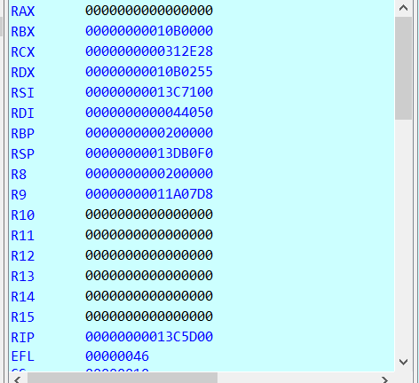
   
   En esta ejecución:
   
   | ubicación | tipo          | nombre del argumento | valor     |       |
   | ---------- | ------------- | ------------------- | --------- | ----- |
   | rdi        | void *        | rmode               | 0x44050   |       |
   | rsi        | memptr        | heap                | 0x13C7100 |       |
   | rdx        | unsigned char | input_data          | 0x10B0255 |       |
   | rcx        | unsigned long | input_len           | 0x312E28  | ~3MB  |
   | r8         | unsigned char | output              | 0x200000  |       |
   | r9         | unsigned long | output_len          | 0x11A07D8 | ~17MB |

   Inspeccionando los datos en `input_data`:

   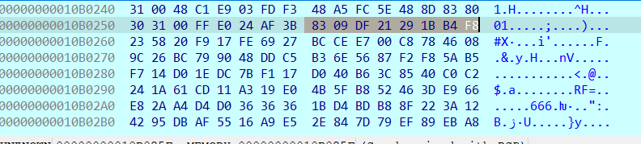

   Busque los bytes de input_data, se encontró una coincidencia en el archivo vmlinuz en un offset bastante pequeño:

   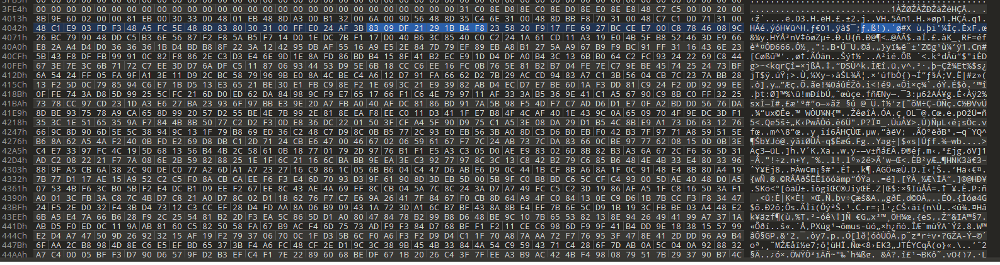

   6. Dentro de la función `extract_kernel`, seleccione un breakpoint justo después de que el kernel comprimido sea descifrado y descomprimido, y justo antes de que el kernel sea parseado por ELF y reubicado.
   
      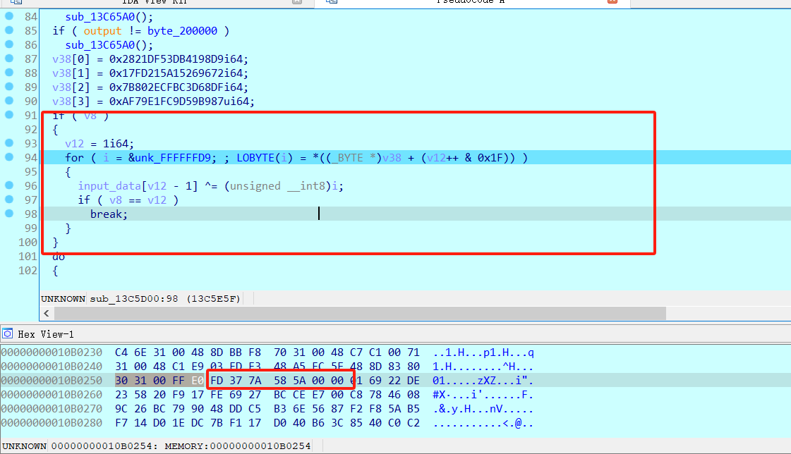
   
      Después de este fragmento de código, `input_data` está descifrado; aparece un encabezado que comienza con `0xFD377A585A`, que parece ser algún número mágico de compresión.
   
      Y después de la descompresión, ¡podemos volcar el vmlinux en 0x200000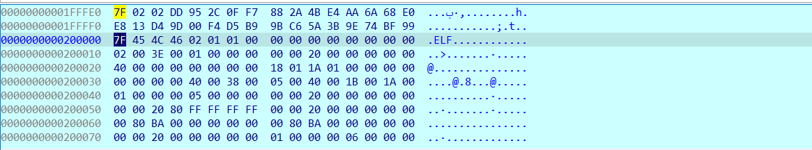

​		En la consola de python de ida, vuelque el kernel; necesitamos dos argumentos, `output` y `output_len`, anotados en la entrada de este procedimiento.

​		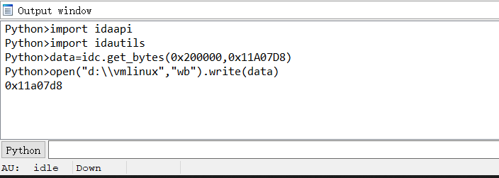

7. En este punto, podemos usar `vmlinux-to-elf` para convertir el kernel volcado a elf, y luego cargarlo con ida.

   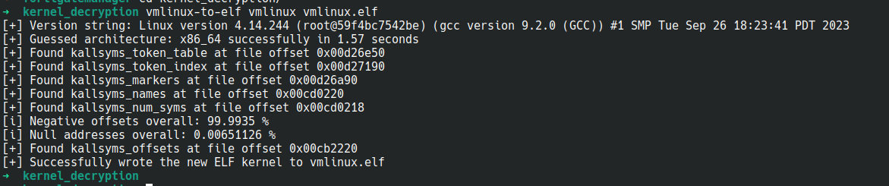

Ahora tenemos el kernel-elf, examínelo estáticamente; buscando `populate_rootfs`, parece que no hay código adicional para el descifrado de rootfs.gz.

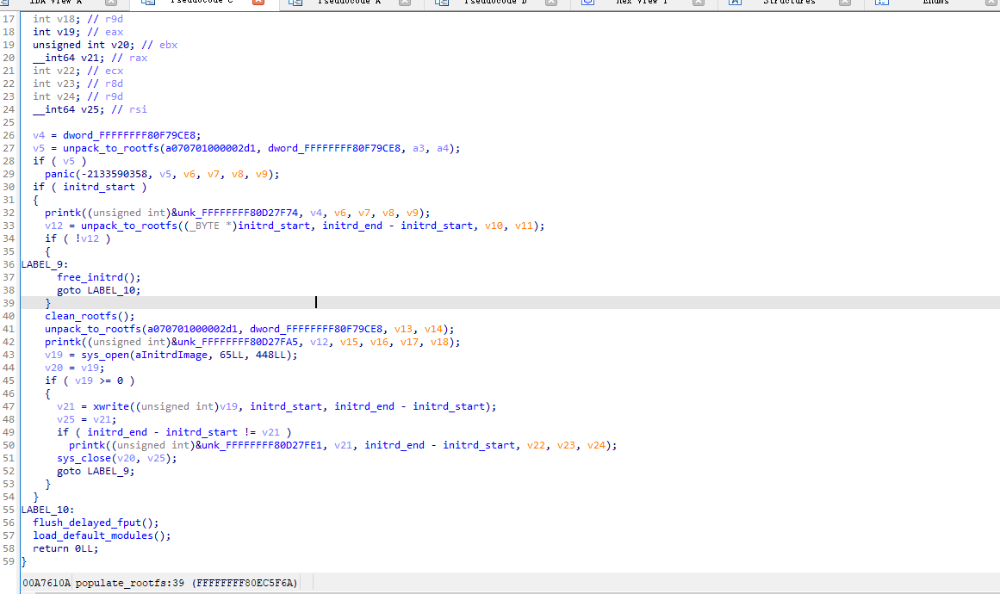

Pero, después de indagar un poco, mirando la referencia cruzada a la variable global `initrd_start` e `initrd_end`, encontramos algo:

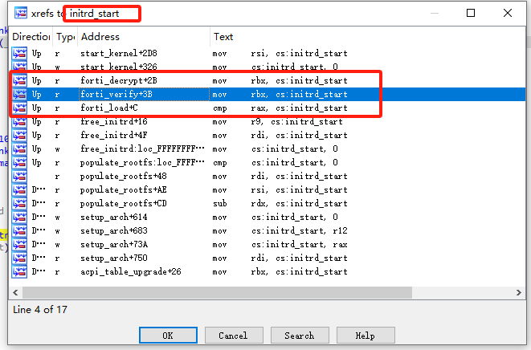

Funciones: `forti_load` y `forti_verify` y `forti_decrypt`

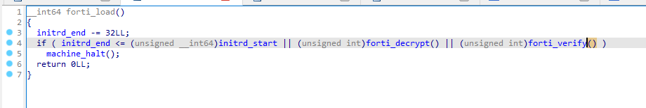

Eso es todo.

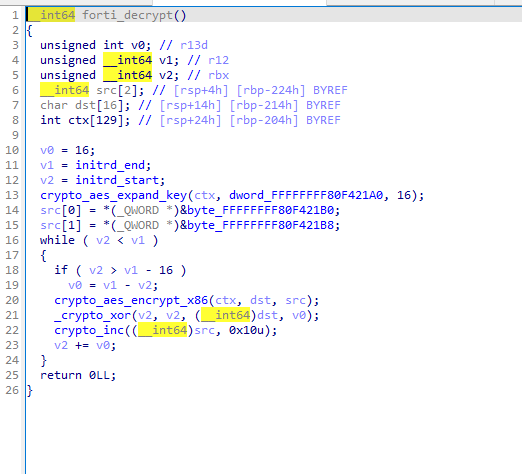

8. Para tomar un atajo, volcamos la memoria justo después de que el rootfs.gz sea descifrado.

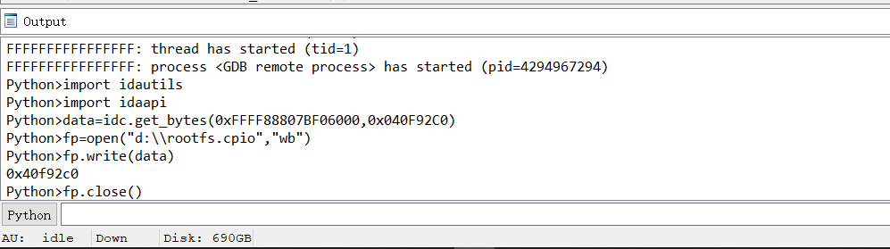

Un pequeño error tipográfico aquí, el archivo volcado es rootfs.cpio.gz en realidad; este proceso de volcado puede tardar un poco ya que el archivo tiene ~68MB.

Finalmente:

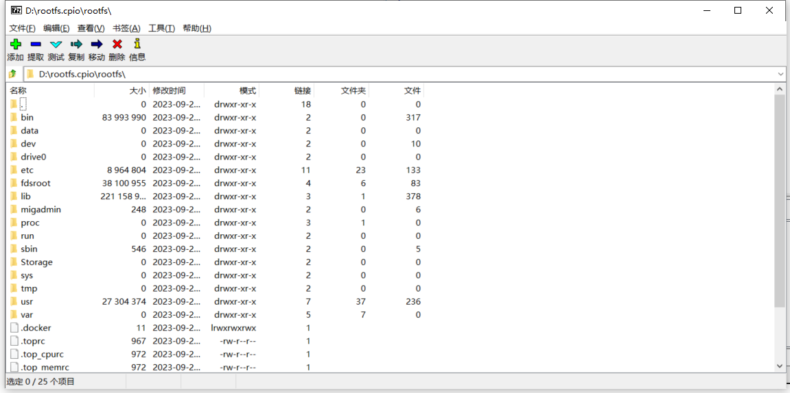

#### Cómo localizar la función extract_kernel

Ejemplo con FMG versión 7.6.0

##### Primero identifique la versión del kernel:

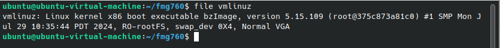

##### Busque el código fuente del kernel 

La mayoría de los desarrolladores de firmware utilizan el código del kernel mainline como base, añadiendo su código propietario para implementar la cadena de bootstrap segura, pero el código mainline original aún puede ayudar a obtener un mejor entendimiento del binario vmlinuz del kernel.

header.S es un archivo de ensamblador que se vincularía a la imagen del kernel al principio del texto, que se ejecuta en modo real y realiza algunos trabajos de preparación para entrar en modo protegido/long (exclusivo de x86), como configurar algunos registros o inicializar la gestión de memoria.

EJ. https://elixir.bootlin.com/linux/v5.15.109/source/arch/x86/boot/compressed/head_64.S

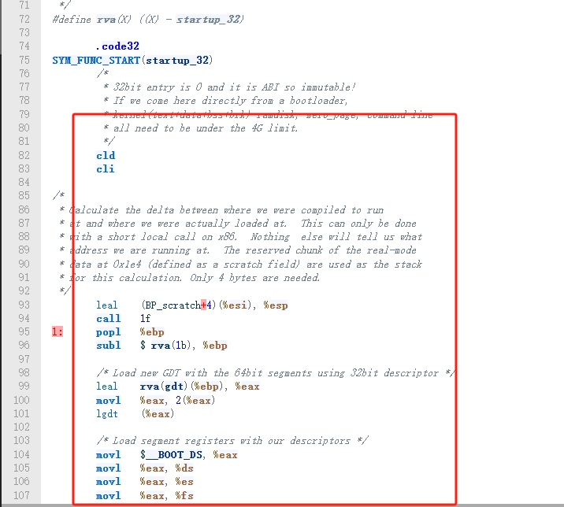

Tenga en cuenta que el código asm en la fuente está escrito en el sabor AT&T, mientras que en ida es estilo Intel.

##### En conjetura con la depuración de ida

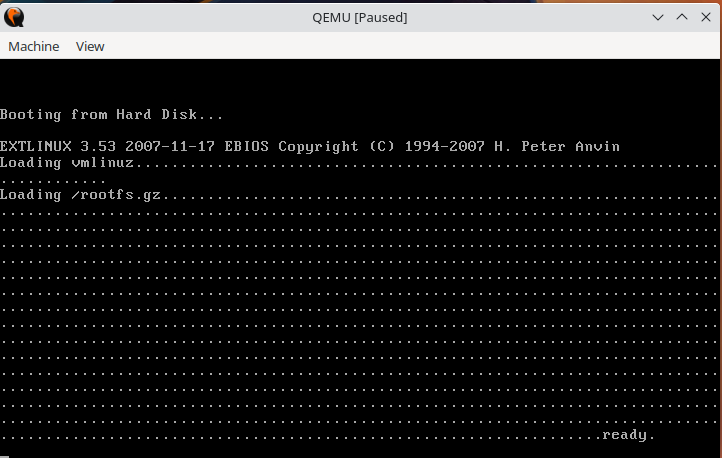

Tenga en cuenta que los mensajes "Loading vmlinuz" y "Loading /rootfs.gz" provienen del cargador de arranque, no del kernel.

El breakpoint no se activará hasta que vea "ready" en la consola, que es el punto en el que el cargador de arranque transfiere la CPU a vmlinuz.

##### **Comparando el código fuente con el vmlinuz**

En términos sencillos, no de una manera muy formal, a nivel de código fuente, `extract_kernel` es llamado por `.Lrelocated`, y `.Lrelocated` es llamado por `startup_64` / `startup_32`.

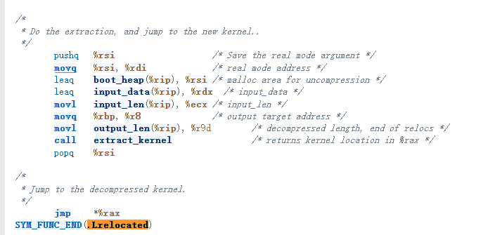

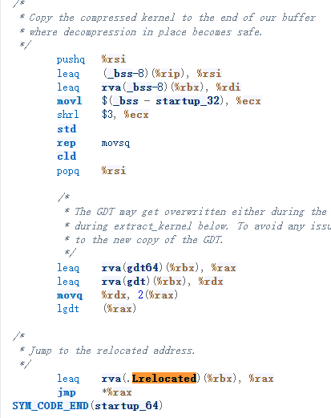

Todo lo que necesitamos hacer es encontrar la dirección de estas funciones en la vista de depuración.

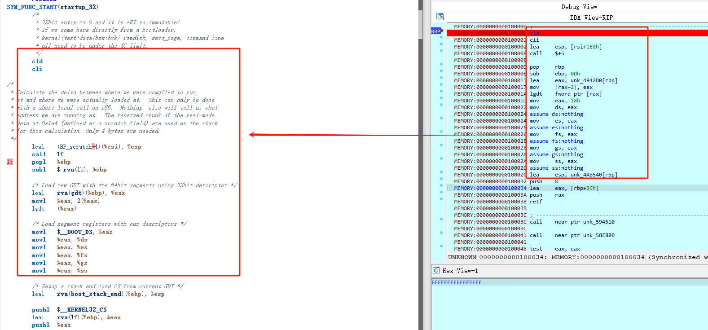

cld cli leacall pop marcan el principio.

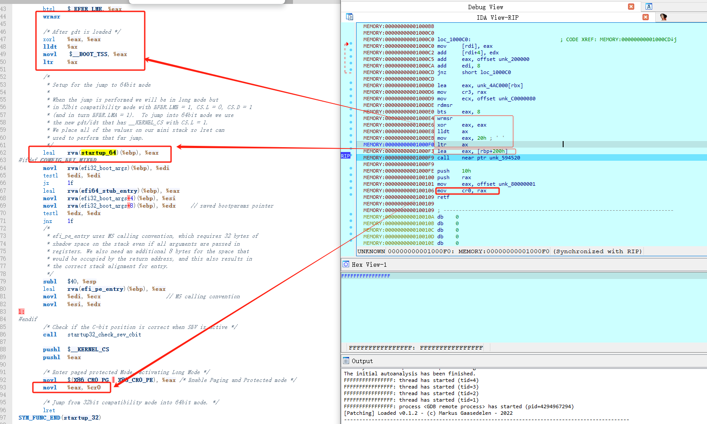

En `0x100f3` descubra dónde está `startup_64` a partir del registro `eax`.

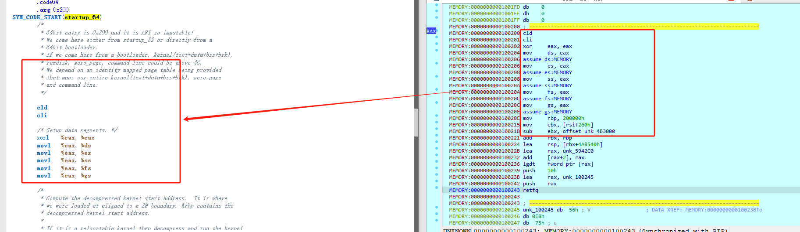

Al final de startup_64 `0x102bd`, se encuentra `.Lrelocate`.

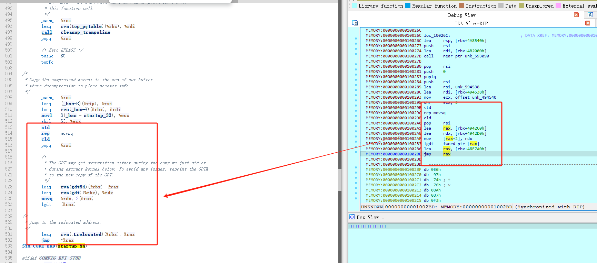

En este punto hemos localizado con éxito el `extract_kernel` desde la instrucción call en `0x166f7f1`.

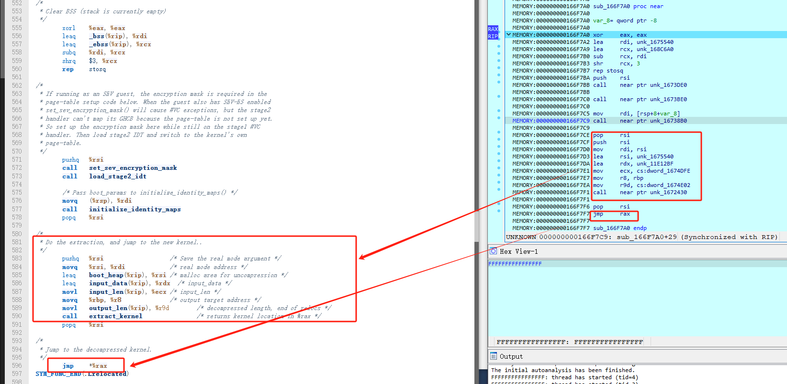

`extract_kernel` en esta versión de fmg está en `0x1672430`.

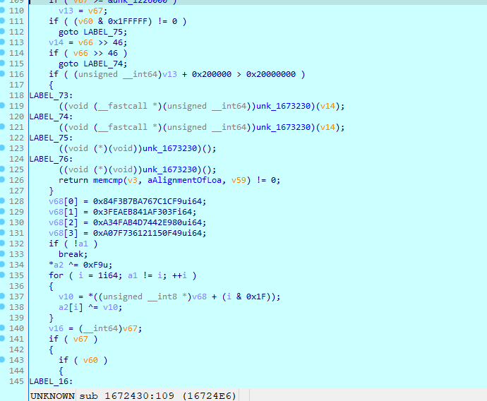
