# Dummy way to dump kernel and rootfs in fortigatemanager FMG 7.2.4 virtual machine

0. mount the vm disk, we could have the vmlinuz file and rootfs.gz file

   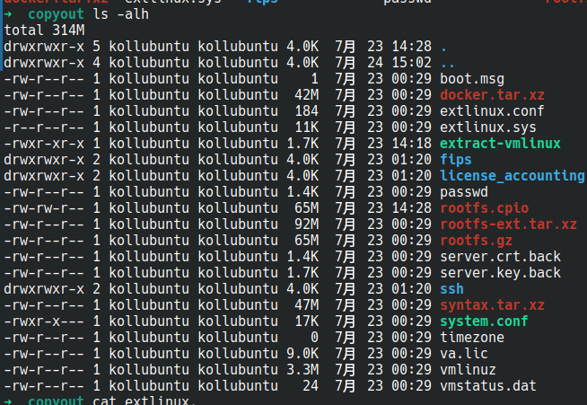

   normally we adopt the [extract-vmlinux script](https://github.com/torvalds/linux/blob/master/scripts/extract-vmlinux) to get the vmlinux image from an compressed kernel file, but on this version,  it doesn't work as expected

   the script searches for predefined magic number of mainline-supported compression output header, which in this case does not exist in the vmlinuxz file

   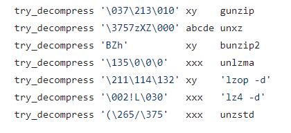

   best guess is that the kernel is decrypted, here there could be two possibilities:

   ​	a. bootloader `extlinux` is responsible for decrypting the kernel vmlinux 

   ​	b. early stage code of vmlinuz is responsible for decrypting 

   considering that first stage of extlinux bootloader is two tiny, jump to the extlinux.sys file, after inspecting the extlinux.sys file, first possibilities is out

1. boot up the vm with qemu in debug mode

   To boot up the FMG, we need an additional disk as data disk, 

   ```bash
   qemu-img create -f qcow2 virtiob.qcow2 20G
   ```

   now there is two disks: `virtioa.qcow2`and `virtiob.qcow2`

   append `-S` and `-s` flag to qemu to enable gdb remote debug listening

   ```bash
   qemu-system-x86_64  -drive file=virtioa.qcow2 -drive file=virtiob.qcow2 -m 4G -smp 4 -s -S -netdev tap,id=net0,ifname=tap0,script=no,downscript=no -device virtio-net-pci,netdev=net0 -netdev tap,id=net1,ifname=tap1,script=no,downscript=no -device virtio-net-pci,netdev=net1 -netdev tap,id=net2,ifname=tap2,script=no,downscript=no -device virtio-net-pci,netdev=net2 -netdev tap,id=net3,ifname=tap3,script=no,downscript=no -device virtio-net-pci,netdev=net3
   ```

2. open ida64 and connect to the qemu gdb stub

   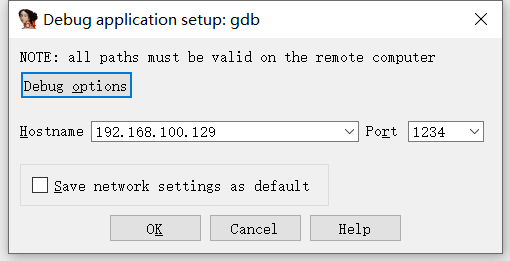

so as connection has been setup, add a manual memory region starting at `0x0` and ending at `0xFFFFFFFFFFFFFFF0`

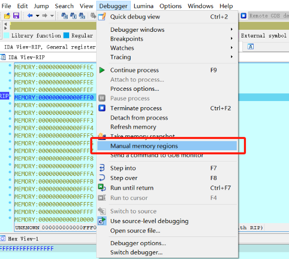

like this:

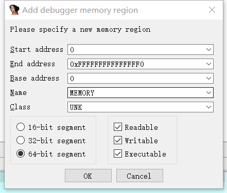

3. from the [linux kernel boot process](https://0xax.gitbooks.io/linux-insides/content/Booting/linux-bootstrap-5.html)  and the [related code](https://elixir.bootlin.com/linux/v4.14.200/source/arch/x86/boot/compressed/misc.c#L279) we know that kernel has several boot stages, out best guess is that the decryption of vmlinux is happening right before decompress of vmlinux

   from the boot protocol we could have some address for setting breakpoints

   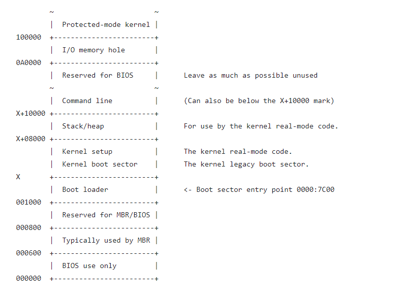

   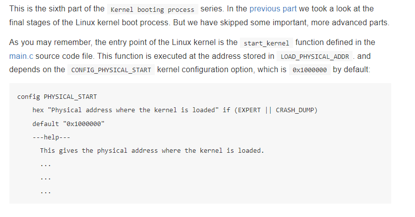

   set a breakpoint at 0x100000 and look around in first, where the early stage begins, 


4. after some time we could find the function at , which is `extract_kernel` function is `arch/x86/boot/compressed/misc.c` in source,

   the prototype of this extract_kernel function goes like this, by breaking at the entrance we can obtain the `output` and `output_len` two args, which are `decompressed kernel pointer` and `decompressed kernel data length integer` respectively

   ```c
   asmlinkage __visible void *extract_kernel(void *rmode, memptr heap,
   				  unsigned char *input_data,
   				  unsigned long input_len,
   				  unsigned char *output,
   				  unsigned long output_len)
   ```

   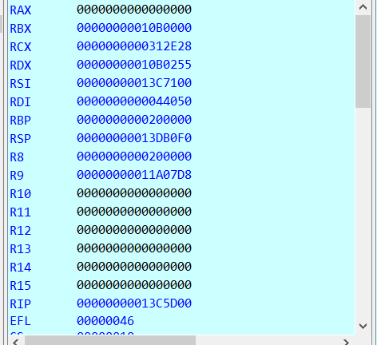

   in this demo:

   | location | type          | arguement name | value     |       |
   | -------- | ------------- | -------------- | --------- | ----- |
   | rdi      | void *        | rmode          | 0x44050   |       |
   | rsi      | memptr        | heap           | 0x13C7100 |       |
   | rdx      | unsigned char | input_data     | 0x10B0255 |       |
   | rcx      | unsigned long | input_len      | 0x312E28  | ~3MB  |
   | r8       | unsigned char | output         | 0x200000  |       |
   | r9       | unsigned long | output_len     | 0x11A07D8 | ~17MB |

   inspecting data at `input_data`:

   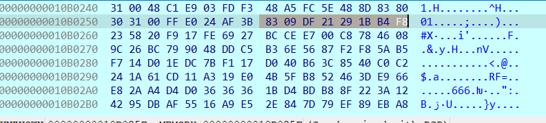

   

   search the bytes of input_data, match found in the vmlinuz file at rather small offset:

   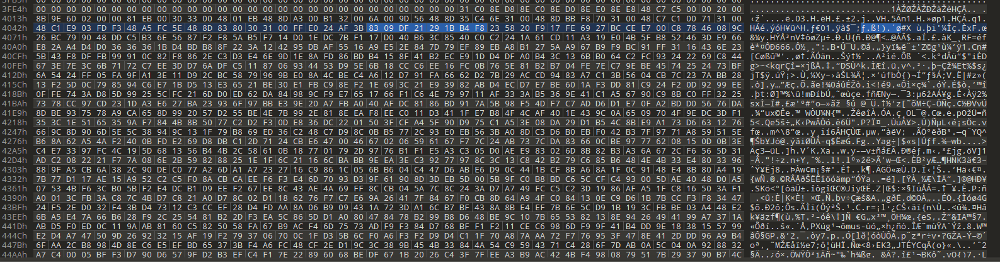

   

   6. inside the `extract_kernel` function select a breakpoint right after the compressed kernel is decrypted and decompressed, and right before the kernel is ELF-parsed and relocated

      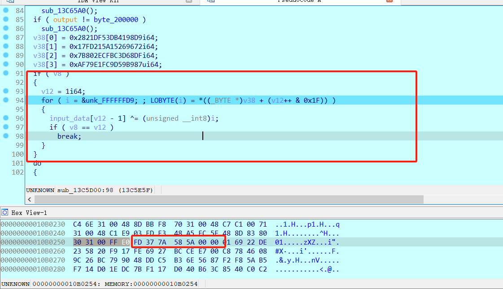

      after this piece of code, `input_data` is decrypted

      and after the decompression, we could dump the vmlinux at 0x200000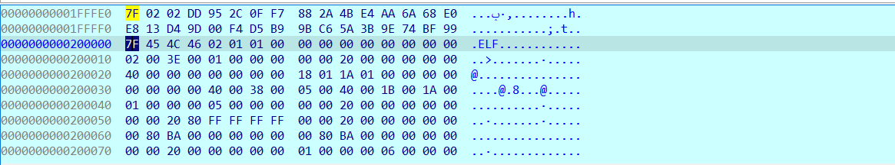

​		in th ida python console, dump the kernel, we need two arguments, `output` and `output_len`, which we noted at the entrance of this procedure

​		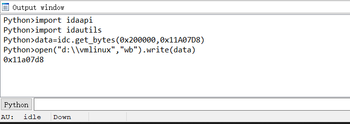

7. at this point, we could use `vmlinux-to-elf` to convert the dumped kernel to elf, and the open it with ida

   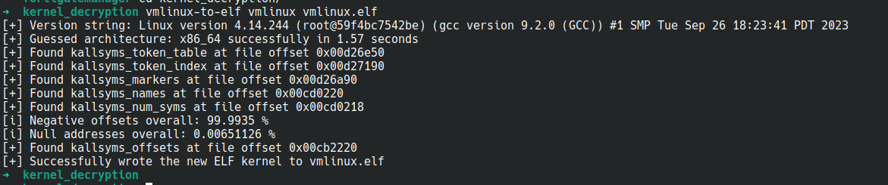

now we have kernel-elf, examine it statically, looking for `populate_rootfs`, seems that there is  no additional code for decryption of rootfs.gz

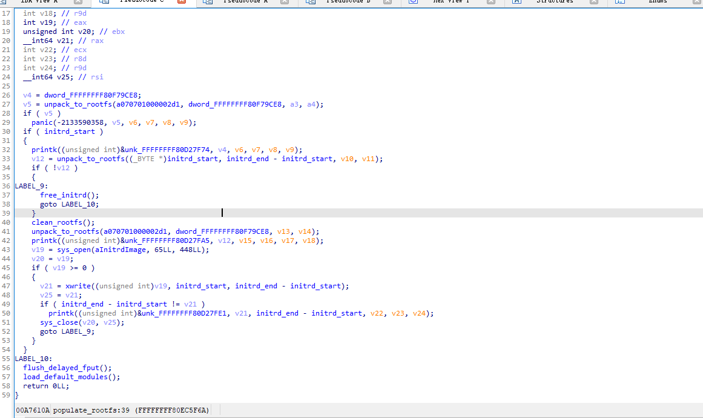

but, after some digging,  looking at the cross reference to global variable `initrd_start` and `initrd_end`, found some thing:

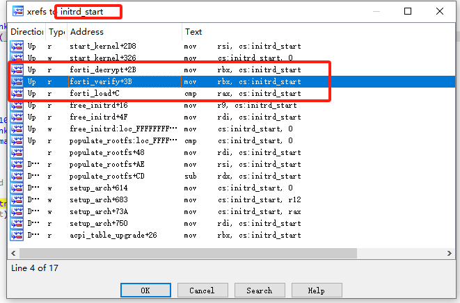

two functions: `forti_load` and `forti_verify` and `forti_decrypt`


that's it!

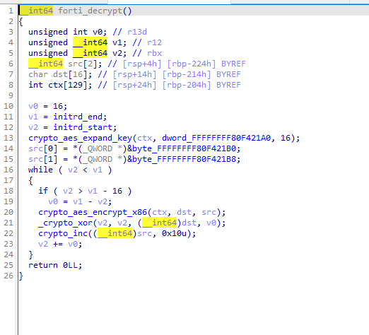

8. for a shortcut, still we dump the memory right after the rootfs.gz is decrypted, 


a little typo here, the dump file is rootfs.cpio.gz  actually, this dump process could take a while as the file is ~68MB

finnaly

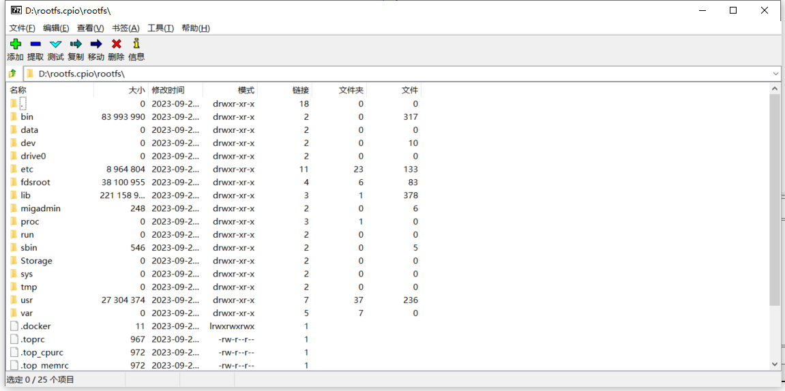